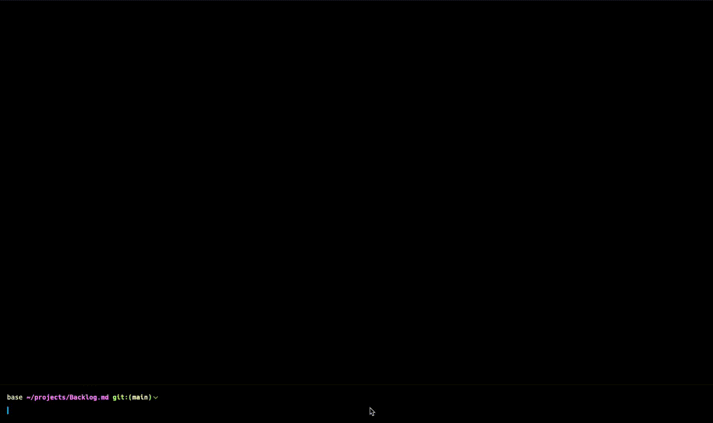

<h1 align="center">Backlog.md</h1>
<p align="center">Markdown‑native Task Manager &amp; Kanban visualizer for any Git repository</p>

<p align="center">
<code>npm i -g backlog.md</code> or <code>bun add -g backlog.md</code>
</p>




---

> **Backlog.md** turns any folder with a Git repo into a **self‑contained project board**  
> powered by plain Markdown files and a zero‑config CLI.


## Features

* 📝 **Markdown-native tasks** -- manage every issue as a plain `.md` file

* 🔒 **100 % private & offline** -- backlog lives entirely inside your repo
* 📊 **Instant terminal Kanban** -- `backlog board` paints a live board in your shell

* 🤖 **AI-ready CLI** -- "Claude, please take over task 33"

* 🔍 **Rich query commands** -- view, list, filter, or archive tasks with ease

* 💻 **Cross-platform** -- runs on macOS, Linux, and Windows

* 🆓 **MIT-licensed & open-source** -- free for personal or commercial use

---

### Five‑minute tour

```bash
# 1. Bootstrap a repo + backlog
backlog init hello-world

# 2. Capture work
backlog task create "Render markdown as kanban"

# 3. See where you stand
backlog board view
```

All data is saved under `.backlog` folder as human‑readable Markdown with the following format `task-<task-id> - <task-title>.md` (e.g. `task-12 - Fix typo.md`).

---

## CLI reference (essentials)

| Action      | Example                                              |
|-------------|------------------------------------------------------|
| Create task | `backlog task create "Add OAuth System" [-l <label1>,<label2>]`                    |
| Create sub task | `backlog task create -p 14 "Add Login with Google"`|
| List tasks  | `backlog task list [-s <status>] [-a <assignee>]`     |
| View detail | `backlog task 7`                                     |
| Edit        | `backlog task edit 7 -a @sara -l auth,backend`       |
| Archive     | `backlog task archive 7`                             |
| Draft flow  | `backlog draft create "Spike GraphQL"` → `backlog draft promote 3.1` |
| Demote to draft| `backlog task demote <id>` |
| Kanban board      | `backlog board`            |

Full help: `backlog --help`

---

## Configuration

Backlog.md merges the following layers (highest → lowest):

1. CLI flags  
2. `.backlog/config.yml` (per‑project)  
3. `~/.backlog/user` (per‑user)  
4. Built‑ins  

Key options:

| Key               | Purpose            | Default                       |
|-------------------|--------------------|-------------------------------|
| `default_assignee`| Pre‑fill assignee  | `[]`                          |
| `default_status`  | First column       | `To Do`                       |
| `statuses`        | Board columns      | `[To Do, In Progress, Done]`  |
| `date_format`     | ISO or locale      | `yyyy-mm-dd`                  |

---


## License

Backlog.md is released under the **MIT License** – do anything, just give credit. See [LICENSE](LICENSE).
